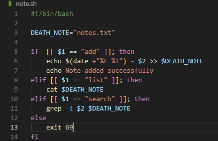

## Due 1/15/2025
---
# Note to Shelf Assignment
---
### Assingment details
---
|The note shelf assignment tasked us with creating something that could 
- Add things to a list
- Show the list
- Search for key terms used from words inside the list
- Each item must show the time stam for when it was added

|There were also some conditions that the code must follow

- The code must be made in shell script
- Have error handeling
- Input validation
- Logging and debuging
- Adding notes with special characters
- Search functionality accuracy
- Proper exit codes for success/failure
---
### What I did
---
|to test my list i aded several things to it like 
- ` `
- `@!`
- `i like this list`
- `i dont like this list`
---
|I added a varity of things to test the several requirements the `@!` is to test for special characters 
|
|the ` ` is to see if i could do spaces (I could) and the `i like this list` and the `i dont like this list` 
|
|were to test the `search` function testing things like `./note.sh search like` to see if both would come up 
|
|(they did) and `./note.sh search dont` to see if only a single one would come up.
---

        ***Koen Kleifgen***